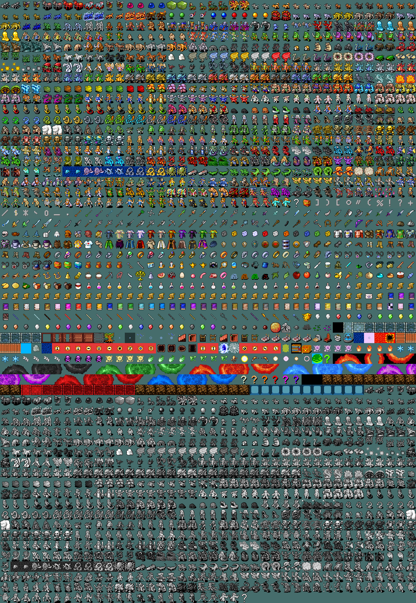
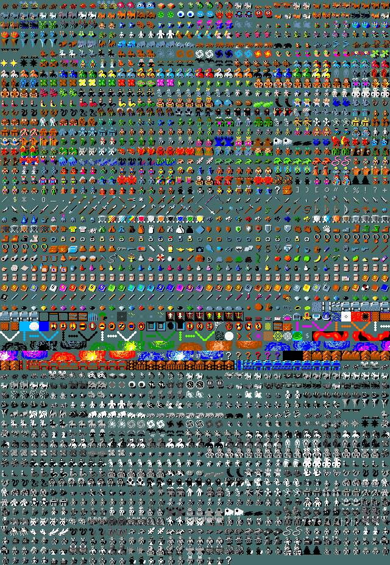

Last updated 6 April 2026.

# `tileto370.py`
Convert NetHack 3.6.x tilesets to the NetHack 3.7.0 beta layout.

The script reads one or more source tileset images, reorders/copies tiles to the 3.7 layout, and writes new output files with a suffix.


## Quick Start
```bash
git clone https://github.com/horlogeislux/tileto370.git
cd tileto370

uv sync
source .venv/bin/activate

python tileto370.py /path/to/tileset.png --tile-width 32
```

## CLI Usage
```bash
python tileto370.py [--help] [--tile-width TILE_WIDTH] [--tile-height TILE_HEIGHT] \
                    [--suffix SUFFIX] [--mode MODE] \
                    paths [paths ...]
```

### Options
- `--help`: show help and exit.
- `--tile-width`, `-w`: tile width in pixels.
- `--tile-height`, `-h`: tile height in pixels.
- `--suffix`: output suffix (default: `-370`).
- `--mode`, `-m`: conversion mode (default: `magenta`).
- Note: short `-h` is used for tile height, so help is available as `--help`.

## Behavior Notes
- You must provide at least one of `--tile-width` or `--tile-height`.
- If only one dimension is provided, it is used for both width and height.
- `paths` accepts multiple images.
- Non-file paths are skipped with a warning (conversion continues).
- Logging goes to both stdout and `converter.log`.

## Modes
### 1. Color mode (default)
Set `--mode` to any Pillow color value (for example `magenta`, `green`, `#339AFA`).

Behavior:
- Existing tiles are reordered into the 3.7 output layout.
- Missing/negative alias tiles keep the selected background color.

### 2. `redirect`
Fill missing/negative alias tiles by redirecting to similar old tiles.

Example:
```bash
python tileto370.py tileset.png -w 32 -m redirect --suffix _redirect
```

### 3. Fuse mode (file path)
Set `--mode` to a file path (for example a sparse 3.7 base tileset image).
The converted output is pasted onto that file.

Important:
- The fuse image must match the exact output pixel size:
  - width: `40 * tile_width`
  - height: `58 * tile_height`

If dimensions do not match, the script exits with an error.

### 4. Not implemented yet
- `chess` mode
- folder-based import mode

Currently these paths raise `NotImplementedError`.

## Examples
Get help:
```bash
python tileto370.py --help
```

Basic conversion:
```bash
python tileto370.py tileset.png -w 32
```

Equivalent rectangular form:
```bash
python tileto370.py tileset.png --tile-width 32 --tile-height 32
```

Custom background color:
```bash
python tileto370.py tileset.png -w 32 --mode "#339AFA" --suffix _hex
```

Fuse onto a sparse 3.7 base:
```bash
python tileto370.py tileset.png -w 32 --mode newtiles.png --suffix _fuse
```

## Result Images
Definitive Nevanda 3.7.0 tileset:
[resources/nevanda/nevanda-370-fuse.png](resources/nevanda/nevanda-370-fuse.png)



Official reference 3.7.0 tileset:
[resources/nhtiles/nhtiles-370.png](resources/nhtiles/nhtiles-370.png)

Please read the official repository and license:
<https://github.com/NetHack/NetHack/tree/NetHack-3.7>


